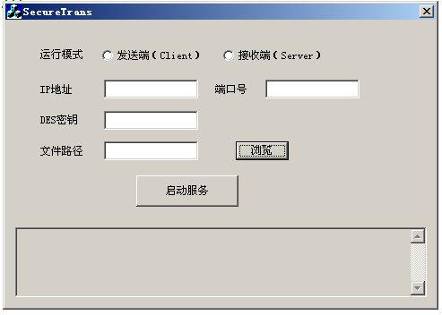
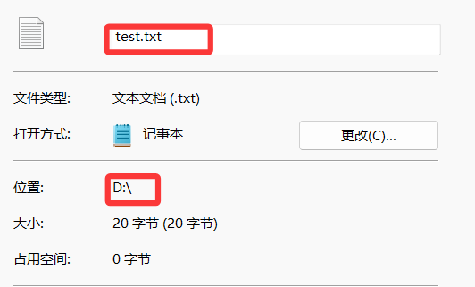
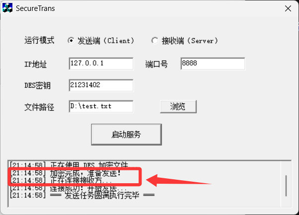
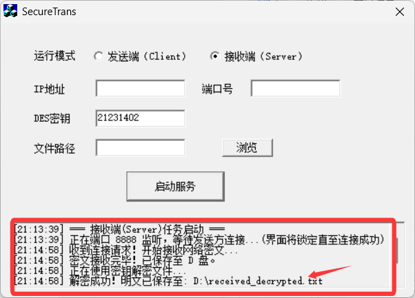
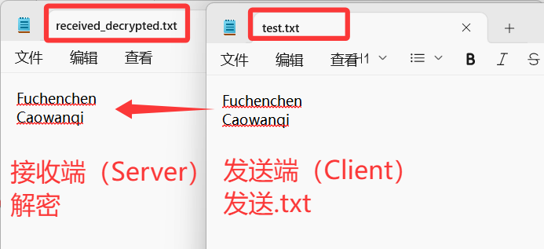
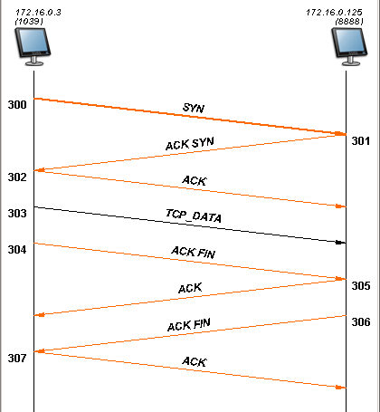
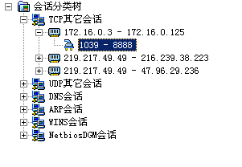
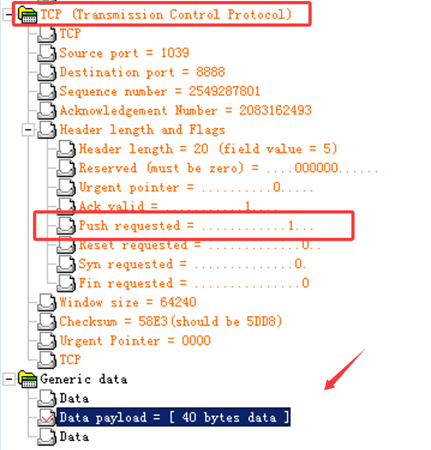

# SecureTrans

## 项目简介
SecureTrans 是一个基于 C++ 和 MFC 的安全文件传输工具，结合了密码学和网络通信技术，旨在实现文件的加密传输和安全验证。该项目采用 DES 对称加密算法保护数据机密性，并通过 Windows Sockets 实现网络通信。

  

## 功能特性
1. **文件加解密**：支持任意格式和大小的文件加密与解密，采用 DES 分组加密算法。
2. **网络传输**：基于 TCP 协议的可靠文件传输，支持客户端和服务端模式切换。
3. **网络监听**：通过嗅探工具验证明文与密文传输的安全性。
4. **用户界面**：基于 MFC 的对话框界面，提供直观的操作和实时日志反馈。

## 系统架构
- **架构模式**：C/S（客户端/服务端）模型。
- **通信协议**：TCP（SOCK_STREAM）。
- **加密算法**：DES（Data Encryption Standard）。
- **开发环境**：Windows + VC++6.0。

## 使用说明
### 环境配置
1. 确保已安装 Windows 操作系统和 VC++6.0 开发环境。
2. 下载并解压项目文件。

### 编译与运行
1. 使用 VC++6.0 打开 `SecureTrans.dsw` 工程文件。
2. 编译并生成可执行文件。
3. 运行程序，选择发送端或接收端模式。

### 操作步骤
#### 发送端
1. 配置目标 IP 地址和 DES 密钥（8 字节）。
2. 选择待加密的文件。
3. 点击“加密并发送”按钮，程序将自动完成文件加密和网络传输。

  
  

#### 接收端
1. 配置监听端口（默认 8888）。
2. 等待连接并接收密文文件。
3. 输入相同的 DES 密钥，点击“解密”按钮，完成文件解密。

  
  

## 系统设计
### 核心模块
1. **加密模块**：
   - 使用 DES 算法对文件进行分块加密。
   - 支持自动补 0 填充，确保文件完整性。
2. **网络模块**：
   - 基于 Winsock2 实现 TCP 连接。
   - 支持文件分片传输，确保数据可靠性。
3. **界面模块**：
   - 基于 MFC 的事件驱动界面。
   - 提供日志窗口实时显示操作状态。

### 流程概述
1. **初始化**：
   - 启动程序并初始化套接字库。
   - 配置工作模式、IP 地址和密钥。
2. **发送端流程**：
   - 加密文件并建立 TCP 连接。
   - 发送密文文件并释放连接。
3. **接收端流程**：
   - 监听端口并接收密文文件。
   - 解密文件并保存明文。
4. **安全验证**：
   - 使用嗅探工具对比明文与密文传输的差异。

  

  
  

## 注意事项
1. DES 密钥必须为 8 字节，且发送端与接收端需保持一致。
2. 确保网络连接正常，避免传输中断。
3. 使用嗅探工具时，请遵守相关法律法规。

## 文件结构
- `SecureTrans.dsp`：项目文件。
- `SecureTrans.cpp`：主程序入口。
- `SecureTransDlg.cpp`：界面逻辑实现。
- `DES.cpp`：DES 加密算法实现。
- `res/`：资源文件（图标、位图等）。
- `Docs/`：实验报告及相关文档。

## 许可证
本项目仅供学习与研究使用，禁止用于任何商业用途。